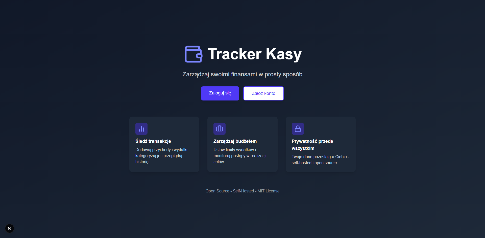
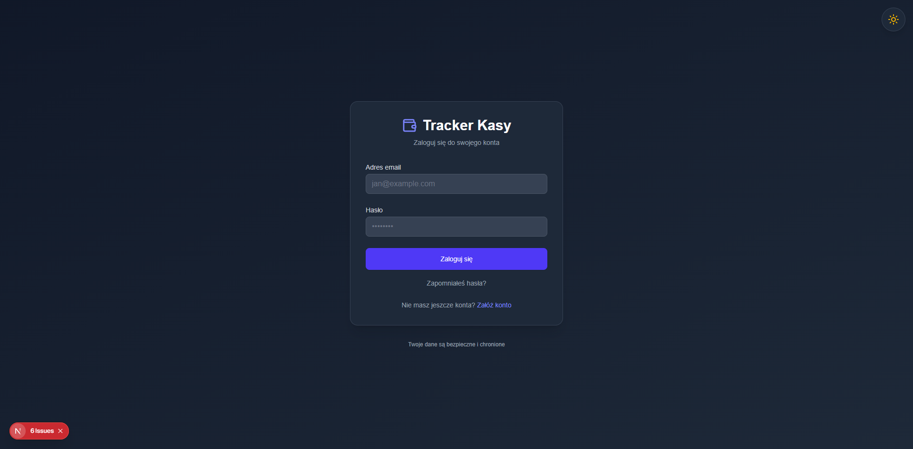
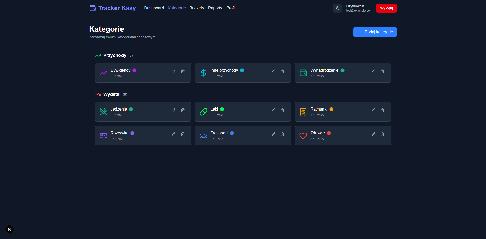
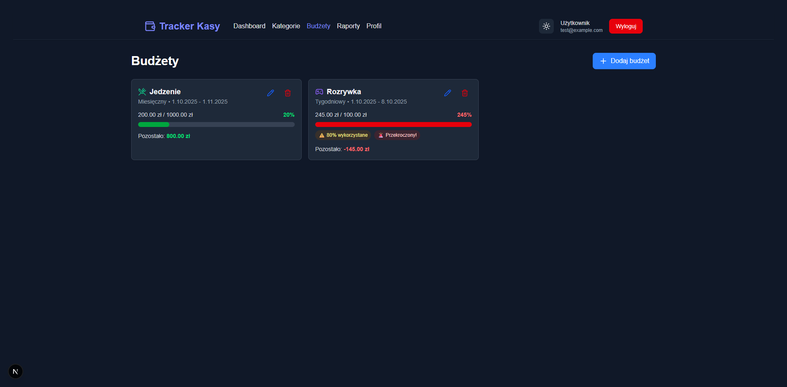
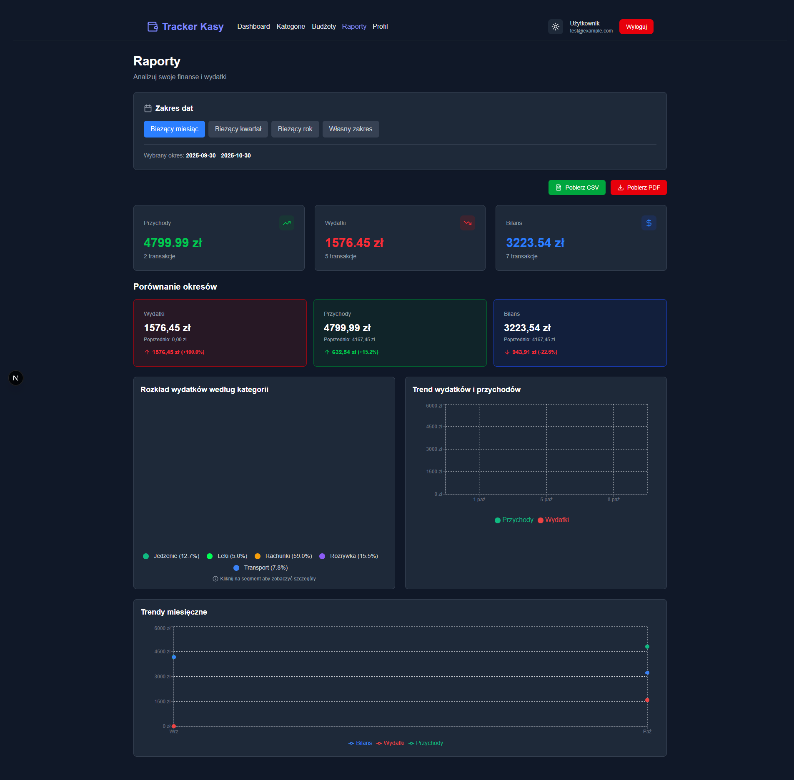

# Finch - Personal Finance Tracker 🐦

**Open-source, self-hosted web application for personal finance management**

[](LICENSE)
[](https://github.com/PeterPage2115/Finch/releases)
[](https://github.com/PeterPage2115/Finch/actions/workflows/ci.yml)
[](https://github.com/PeterPage2115/Finch/actions/workflows/codeql.yml)
[](https://github.com/PeterPage2115/Finch/actions/workflows/docker-publish.yml)
[](#-testing)

[](https://www.docker.com/)
[](https://www.typescriptlang.org/)
[](https://nextjs.org/)
[](https://nestjs.com/)
[](https://www.postgresql.org/)

> 💡 **UI is currently in Polish.** English i18n coming in v1.1

---

## 📚 Documentation

**📖 [Visit the Wiki](https://github.com/PeterPage2115/Finch/wiki)** for complete documentation:

- **[Home](https://github.com/PeterPage2115/Finch/wiki/Home)** - Documentation overview
- **[Installation Guide](https://github.com/PeterPage2115/Finch/wiki/Installation-Guide)** - Complete setup instructions
- **[FAQ](https://github.com/PeterPage2115/Finch/wiki/FAQ)** - Frequently asked questions

> More pages coming soon! Check the wiki for the latest documentation.

---

## 🚀 Quick Start (TL;DR)

```bash
# Clone repository
git clone https://github.com/PeterPage2115/Finch.git
cd Finch

# Configure (optional - has sensible defaults)
cp .env.example .env
# Edit .env and change JWT_SECRET!

# Start application
docker-compose up -d

# Access at http://localhost:3000
```

**That's it!** 🎉

For detailed instructions, see the [📖 Wiki](https://github.com/PeterPage2115/Finch/wiki).

---

## ✨ Features

- 🔒 **Privacy First** - Self-hosted, your data stays with you
- 🐳 **Easy Deployment** - One command with Docker Compose
- 📊 **Modern UI** - Clean dashboard with interactive charts
- 💼 **Budget Tracking** - Set limits and monitor spending
- 📈 **Financial Reports** - Analyze income, expenses, and trends
- 🎨 **Dark Mode** - Full dark theme support
- 🔐 **Secure** - JWT authentication, bcrypt passwords
- 📱 **Responsive** - Works on desktop and mobile

---

## 📸 Screenshots

<details>
<summary><strong>Click to view screenshots</strong></summary>

<div align="center">
  
### Landing Page


### Dashboard


### Categories Management


### Budget Tracking


### Financial Reports


</div>

</details>

---

## 🛠️ Tech Stack

| Layer | Technology |
|-------|-----------|
| **Frontend** | Next.js 15, React 19, TypeScript, Tailwind CSS v4 |
| **Backend** | NestJS, TypeScript, Prisma ORM |
| **Database** | PostgreSQL 17 |
| **Deployment** | Docker & Docker Compose |
| **Testing** | Jest, Vitest, React Testing Library |

---

## 📖 Documentation Links

### For Users
- [📖 Wiki Home](https://github.com/PeterPage2115/Finch/wiki)
- [Installation Guide](https://github.com/PeterPage2115/Finch/wiki/Installation-Guide)
- [FAQ](https://github.com/PeterPage2115/Finch/wiki/FAQ)

### For Developers
- [Contributing Guide](CONTRIBUTING.md)
- [Technical Documentation](./docs/technical/)

### Project Info
- [Changelog](CHANGELOG.md) - Version history
- [Security Policy](SECURITY.md) - Report vulnerabilities
- [License](LICENSE) - MIT License

---

## 🤝 Contributing

Contributions are welcome! Please see our [Contributing Guide](CONTRIBUTING.md) for details.

**Ways to contribute:**
- 🐛 Report bugs
- 💡 Suggest features
- 📝 Improve documentation
- 🌍 Translate to other languages
- 🔧 Submit pull requests

---

## 📝 License

This project is licensed under the MIT License - see the [LICENSE](LICENSE) file for details.

---

## 🌟 Support

If you find Finch useful, please consider:
- ⭐ Starring this repository
- 🐦 Sharing with others
- 🐛 Reporting bugs
- 📖 Improving documentation

---

## 📞 Contact & Support

- **Issues:** [GitHub Issues](https://github.com/PeterPage2115/Finch/issues)
- **Security:** [Security Policy](SECURITY.md)
- **Email:** piotr.paz04@gmail.com

---

<div align="center">

**Made with ❤️ for financial freedom**

[Documentation](https://github.com/PeterPage2115/Finch/wiki) • [Report Bug](https://github.com/PeterPage2115/Finch/issues) • [Request Feature](https://github.com/PeterPage2115/Finch/issues)

</div>
